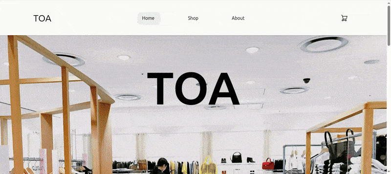

# Shopping Cart

## Summary

A shopping app built with React, Vite, and React Router to create a Single Page Application (SPA). Users can browse items in the shop, add them to a cart, and manage their cart items.

## Model

### Index

| Desktop                                               | Mobile                                              |
| ----------------------------------------------------- | --------------------------------------------------- |
|  |  |

## Project Highlights:

- Using React Router to create a Single Page Application (SPA), making great use of `createBrowserRouter` to set up the app.
- Wrapping child routes in an error handler to ensure any errors are handled gracefully by React Router's error handling.
- Using CSS Modules to style each component individually and maintain scoped styles.
- Thoroughly testing the app using Vitest.
- Using `NavLink` for navigation and `useNavigate` for programmatic navigation.
- Creating a custom hook to fetch data from the API, used in `shoppingPage.jsx` and `index.jsx`.

## Challenges Overcome:

- Properly setting up a React app with React Router.
- Building a functional carousel using `useState`.
- Lifting state correctly to make it accessible throughout the app.
- Effectively using CSS Modules.
- Testing components and mocking fetch requests and Outlet Context.
- Managing shopping cart items and creating functions to update the cart.

## New Skills Acquired:

- Using React Router correctly.
- Simplifying testing in a Vite app with Vitest.
- Importing images properly in a React app.
- Creating global styles, such as reusable button components.
- Building and implementing custom hooks.
- Using Outlet to create the foundation of a SPA.
- Formatting prices using `toFixed()`.
- Implementing error handling in a React Router application.

## Technologies Used:

- HTML
- CSS
- JavaScript
- React
- Vite
- React Router
- Vitest
